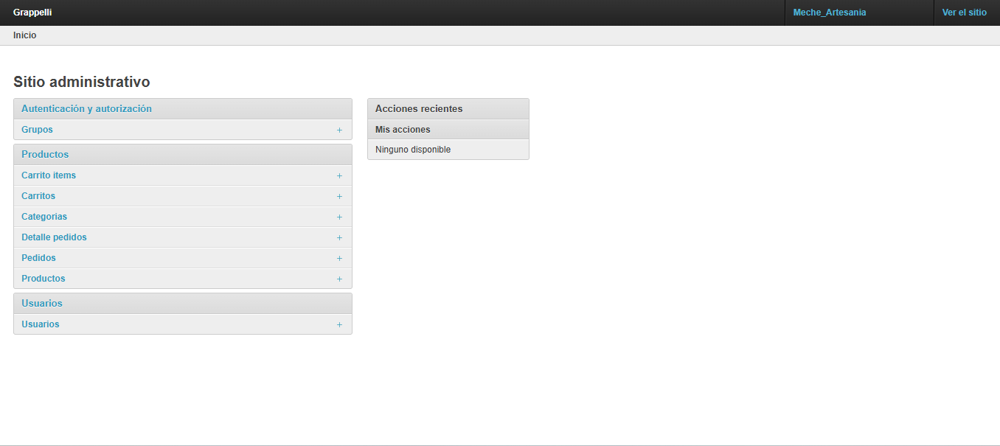

# 🛠️ Panel Administrativo en Django

El sistema cuenta con un **panel administrativo completo** desarrollado con Django Admin. Desde aquí se puede gestionar toda la tienda en línea de forma eficiente y rápida:

- 📦 Agregar, editar y eliminar productos.
- 📁 Crear y asignar categorías.
- 👤 Ver y gestionar usuarios registrados.
- 🛒 Supervisar los pedidos realizados.
- 🖼️ Subir imágenes de productos fácilmente.
- ✅ Visualizar stock y disponibilidad.

## Vista del Panel Admin

A continuación se muestra una vista real del panel de administración personalizado:

> *Nota:* Este panel solo es accesible para los administradores del sitio.
